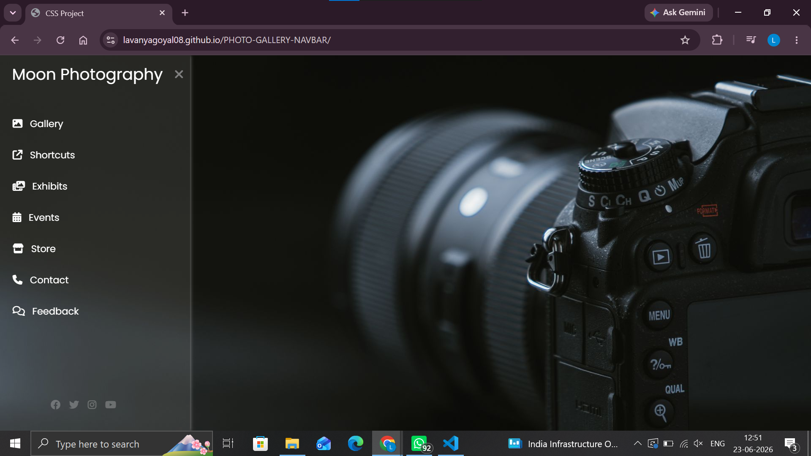

# 📸 Moon Photography Sidebar UI

A modern and responsive sidebar navigation menu for a photography website, built using HTML and CSS. The project features a sleek dark theme, smooth hover effects, and an elegant glassmorphism-inspired design.

<p align="center">
  
</p>

## ✨ Features

- 📷 Responsive sidebar navigation
- 🎨 Modern glassmorphism UI
- ⚡ Smooth hover effects and transitions
- 🌙 Dark-themed design
- 📱 Fully customizable
- 💻 Built with pure HTML and CSS

## 🛠️ Technologies Used

- HTML5
- CSS3
- Font Awesome

## 📂 Project Structure

```
PHOTO-GALLERY-NAVBAR/
│
├── index.html
├── style.css
├── photo.jpg
├── preview.png
└── README.md
```

## 🚀 Getting Started

Follow these steps to run the project locally.

### Clone the repository

```bash
git clone https://github.com/lavanyagoyal08/PHOTO-GALLERY-NAVBAR.git
```

### Navigate to the project folder

```bash
cd PHOTO-GALLERY-NAVBAR
```

### Run the project

Open `index.html` in your preferred web browser.

## 🌐 Live Demo

🔗 https://lavanyagoyal08.github.io/PHOTO-GALLERY-NAVBAR/

## 📸 Preview

The interface features:

- Moon Photography branding
- Sidebar menu with icons
- Smooth animations
- Social media links
- Camera-themed background image

## 👩‍💻 Author

**Lavanya Goyal**

- GitHub: [@lavanyagoyal08](https://github.com/lavanyagoyal08)

## ⭐ Support

If you found this project helpful, please consider giving it a ⭐ on GitHub!

---

<p align="center">
Made with ❤️ using HTML & CSS
</p>